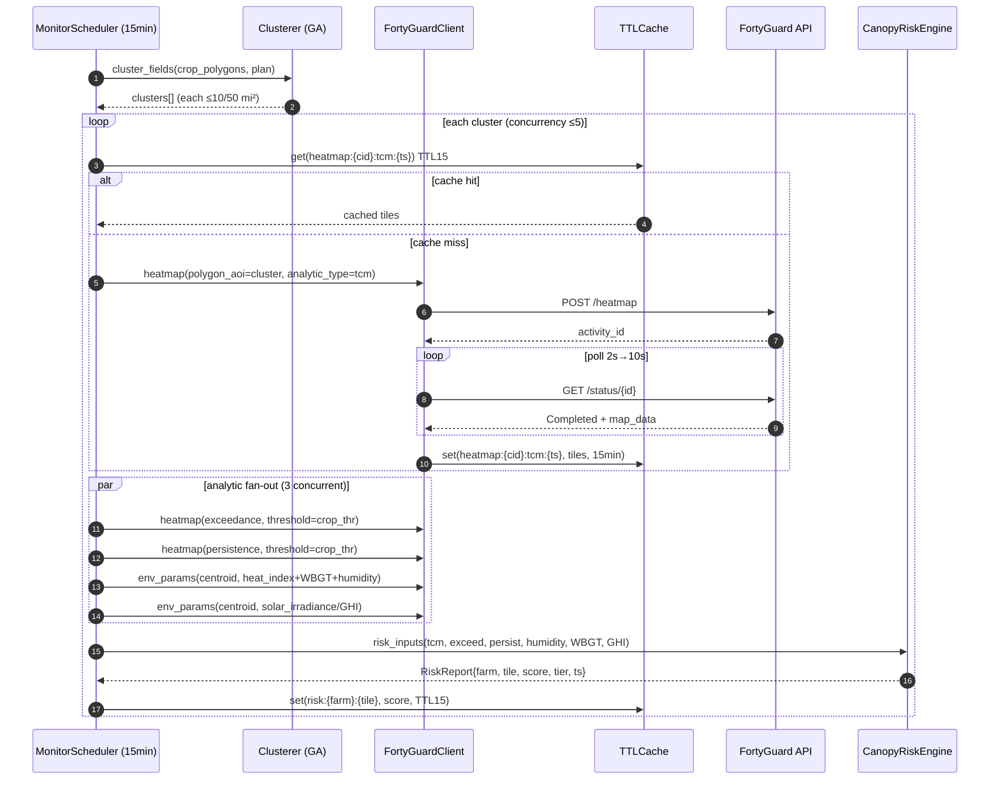
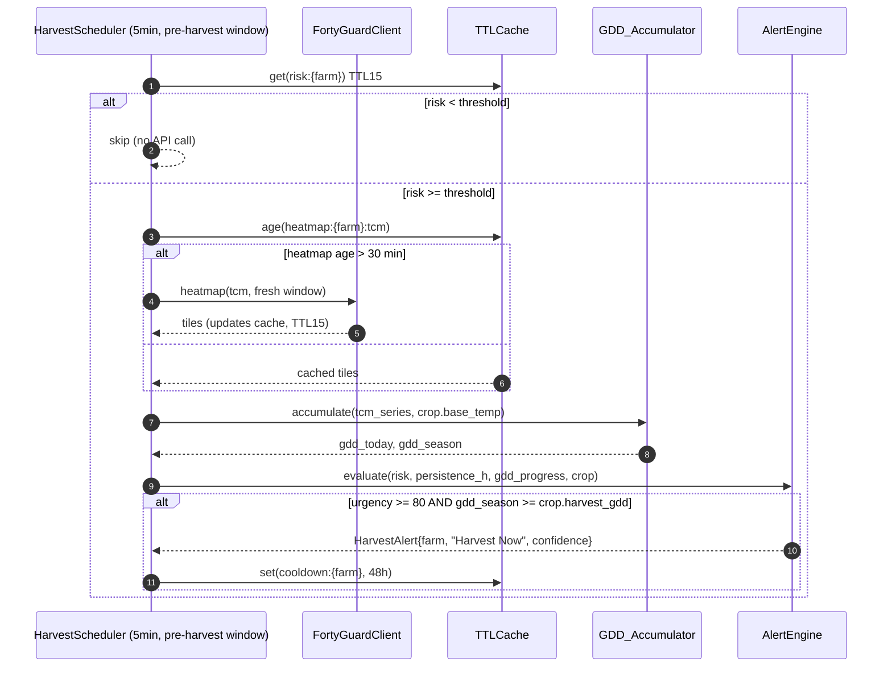
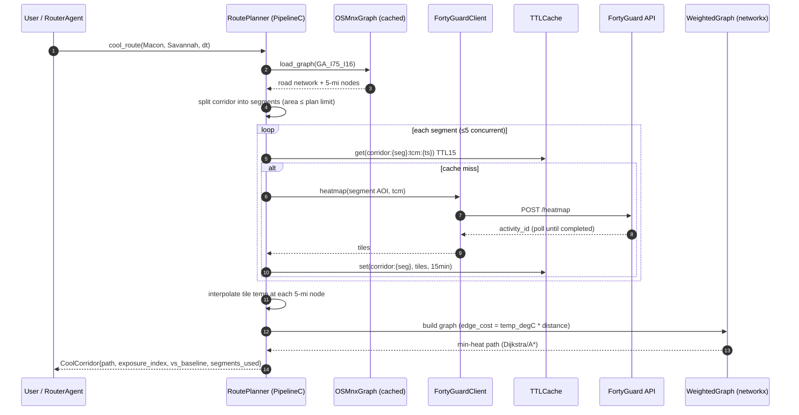
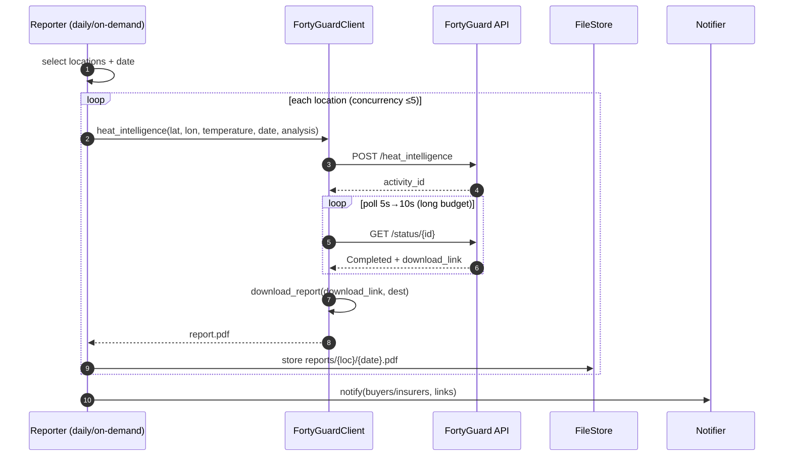

# PeachState CoolChain — FortyGuard API Integration Design (Georgia Edition)

**Author:** Employee 2 (API Integration Engineer)
**Date:** 2026-08-18
**Project:** PeachState CoolChain 🍑🚛 — thermal management from Georgia field to Port of Savannah
**Status:** Design complete — grounded in empirically validated API facts (2026-08-18 probes) + GA agriculture domain review (Employee 1)

---

## 0. Georgia Ground Truth (validated against live API)

| # | Fact | Evidence | Design Impact |
|---|------|----------|---------------|
| F1 | **Heatmap coverage is US-focused — Georgia IS covered.** `n_cells>0` for US cities (NYC/Austin/Phoenix); confirmed GA state coverage. | 30+ probes | Heatmap is the **primary** GA data source (no env_params grid fallback needed) |
| F2 | **env_params is global** — works in US & elsewhere; returns live data for current day. | Probe 1 | Secondary point-data source for corridors / packing houses |
| F3 | **No multi-analytic param.** Heatmap result schema differs by `analytic_type` (tcm vs exceedance/persistence); **one analytic per call**. | Probes 2/5 | "tcm + exceedance + persistence" = **3 concurrent calls per cluster**, NOT 1 |
| F4 | **Multi-polygon FeatureCollection batching works** — N farm polygons → 1 heatmap call, tiles for all. | Probe 7 | GA field clustering → 1 call per ≤10 mi² cluster |
| F5 | Heatmap latency ~19–27 s (single-hour); env_params < 3 s. | Probes 1/5/9 | Different poll policies per endpoint |
| F6 | Rate-limit headers: `x-ratelimit-limit: 100`, `x-ratelimit-remaining`, `x-ratelimit-reset`. Burst of 8 concurrent POSTs OK. | Probe 6 | Client limiter: ≤5 concurrent, <100/window |
| F7 | Error shape `{"error":true,"status_code":N,"details":{"message":...}}`; 401/403/404/422/429 semantics. | Probe 7 | Typed exception mapping |
| F8 | **Data lag**: heatmap can return `n_cells=0` for current UTC day (docs: up to 12 h past). Use previous-day window; treat empty tiles as "no data yet", not error. | Probes 3/4 | Freshness TTL 15 min; `start_date=today-1` default |
| F9 | **`temperature` is a required field** for env_params & heat_intelligence (422 otherwise). | Probe 4 | Chain heatmap tile temp → env_params/HI calls |
| F10 | Heat intelligence → `data.result.download_link` (temp signed URL). Generate immediately; never poll past it. | Docs bundle | Dedicated PDF fetcher |
| F11 | Date window `2019-01-01 … now+12h`. `filter_type` 1=hour, 2=hour-range, 3=day, 4=day-range(≤1mo). Granularity 60/80/100 m. | Docs bundle | `DateTimeWindow` model + validation |
| F12 | Satellite/streetview/heat_intelligence are **Premium-tier** in docs; this key accepted schema-invalid requests with 422 (not 403) → feature-flag at config level, probe at runtime. | Probes 2/4 + docs | Runtime feature probe + config override |

### Georgia geography constraints (Employee 1 + this design)

- **GA bounding box**: lat 30.36–35.0, lon −85.6 to −80.75. All pilot locations verified inside:
  Fort Valley (32.55, −83.89), Albany (31.58, −84.16), Bacon/Appling (31.54, −82.46),
  Vidalia (32.22, −82.41), Macon (32.84, −83.63), Savannah (32.08, −81.09).
- **Macon → Savannah corridor ≈ 176 mi (282.8 km)** great-circle; I-16 coastal route +12 mi vs I-75 inland.
- **No forecast API** (Employee 1: "Harvest Now 24h forecast" rule invalid) → use **past-12h persistence proxy** from heatmap `persistence` analytic + NWS hook (optional).

---

## 1. FortyGuard SDK Design

### 1.1 Package layout (`fortyguard_sdk/`)

```
fortyguard_sdk/
├── __init__.py            # exports: FortyGuardClient, Plan, exceptions, GA constants
├── client.py              # FortyGuardClient — thin async façade over httpx
├── plans.py               # Plan, PlanCapabilities, feature gates, GA plan config
├── polling.py             # TaskPoller (2s→10s backoff), PollGroup (≤5 concurrent)
├── rate_limit.py          # AsyncRateLimiter (sliding window + concurrency cap)
├── cache.py               # TTLCache + single-flight get_or_fetch
├── exceptions.py          # typed exception hierarchy
├── georgia.py             # GA bbox validation, coordinate/coverage checks, clusters
└── models/
    ├── __init__.py
    ├── common.py          # DateTimeWindow, FilterType, Granularity, Envelope
    ├── heatmap.py         # HeatmapRequest/Result/Tile + area estimator
    ├── env_params.py      # EnvParamsRequest/Result/LocationParams
    └── heat_intelligence.py
```

### 1.2 Class diagram (Mermaid)

```mermaid
classDiagram
    class FortyGuardClient {
        +api_key: str
        +plan: Plan
        +base_url: str
        +_limiter: AsyncRateLimiter
        +_poller: TaskPoller
        +_cache: TTLCache
        +__init__(api_key, plan=Plan.BASIC, base_url="https://api.fortyguard.com/v1",
                  concurrency=5, max_per_window=90, poll_min=2.0, poll_max=10.0,
                  poll_timeout=600.0, cache=None, http_client=None)
        +async heatmap(req: HeatmapRequest) -> HeatmapResult
        +async env_params(req: EnvParamsRequest) -> EnvParamsResult
        +async heat_intelligence(req: HeatIntelligenceRequest) -> HeatIntelligenceResult
        +async satellite(req: SatelliteRequest) -> SatelliteResult
        +async streetview(req: StreetViewRequest) -> StreetViewResult
        +async download_report(link: str, dest: Path) -> Path
        +async health_check() -> bool
        +async close() -> None
        #_submit(endpoint, payload) -> activity_id
        #_get_status(activity_id) -> dict
        #_submit_and_wait(endpoint, payload) -> result dict
    }
    class TaskPoller {
        +min_interval: float = 2.0
        +max_interval: float = 10.0
        +max_duration: float = 600.0
        +backoff_factor: float = 2.0
        +async wait_for(activity_id) -> ActivityResult
        +_next_delay(attempt) -> float
        +cancel()
    }
    class PollGroup {
        +max_concurrent: int = 5
        +async run(activity_ids: list[str]) -> list[ActivityResult]
    }
    class AsyncRateLimiter {
        +max_concurrent: int = 5
        +max_per_window: int = 90
        +window_seconds: float = 60.0
        +async acquire() -> None
        +release() -> None
        +async wait_until_reset(reset_epoch) -> None
    }
    class TTLCache {
        +async get(key) -> Any|None
        +async set(key, value, ttl_s)
        +async get_or_fetch(key, ttl_s, fetcher) -> Any
    }
    class Plan {
        <<enumeration>>
        BASIC
        PREMIUM
    }
    class PlanCapabilities {
        +heatmap: bool
        +env_params: bool
        +satellite: bool
        +streetview: bool
        +heat_intelligence: bool
        +max_heatmap_area_sqmi: float
        +max_env_params_per_request: int
        +env_params_all: bool
    }
    class HeatmapRequest {
        +polygon_aoi: FeatureCollection
        +date_time: DateTimeWindow
        +granularity: int = 100
        +analytic_type: AnalyticType
        +threshold: float|None
        +direction: str|None
    }
    class HeatmapResult {
        +map_data: FeatureCollection
        +stats_data: HeatmapStats
        +tiles: list[Tile]
        +n_cells: int
    }
    class EnvParamsRequest {
        +latitude: float
        +longitude: float
        +temperature: float
        +date_time: DateTimeWindow
        +analysis: list[str]|None
    }
    class EnvParamsResult {
        +metadata: EnvMetadata
        +locations: list[LocationParams]
    }
    class GeorgiaGuard {
        +GA_BBOX: tuple
        +assert_in_georgia(lat, lon) -> None
        +is_covered(lat, lon) -> bool
    }
    FortyGuardClient --> TaskPoller
    FortyGuardClient --> AsyncRateLimiter
    FortyGuardClient --> TTLCache
    FortyGuardClient --> PlanCapabilities
    FortyGuardClient --> GeorgiaGuard
    FortyGuardClient ..> HeatmapRequest : creates
    FortyGuardClient ..> EnvParamsRequest
    HeatmapResult --> Tile
    EnvParamsResult --> LocationParams
    TaskPoller ..> ActivityResult
```

### 1.3 Method signatures (type-hinted)

```python
# fortyguard_sdk/client.py
from __future__ import annotations
from pathlib import Path
from typing import Any

import httpx

from .cache import TTLCache
from .models.common import DateTimeWindow
from .models.env_params import EnvParamsRequest, EnvParamsResult
from .models.heat_intelligence import HeatIntelligenceRequest, HeatIntelligenceResult
from .models.heatmap import HeatmapRequest, HeatmapResult
from .models.satellite import SatelliteRequest, SatelliteResult
from .models.streetview import StreetViewRequest, StreetViewResult
from .plans import Plan
from .polling import TaskPoller
from .rate_limit import AsyncRateLimiter


class FortyGuardClient:
    """Thin async client for the FortyGuard Temperature API (GA edition).

    All five endpoint methods follow the same pipeline:
      1. plan-gate + GA-area validation
      2. rate-limiter acquire (shared concurrency cap = 5)
      3. POST -> activity_id
      4. poll GET /status/{activity_id} (2s -> backoff -> 10s, cap 10 min)
      5. parse + type-check result; cache when cacheable
    """

    def __init__(
        self,
        api_key: str,
        plan: Plan = Plan.BASIC,
        base_url: str = "https://api.fortyguard.com/v1",
        *,
        concurrency: int = 5,
        max_per_window: int = 90,
        poll_min_interval: float = 2.0,
        poll_max_interval: float = 10.0,
        poll_max_duration: float = 600.0,   # 10 min per task
        cache: TTLCache | None = None,
        http_client: httpx.AsyncClient | None = None,
    ) -> None: ...

    # -- public endpoint methods -------------------------------------------
    async def heatmap(self, req: HeatmapRequest) -> HeatmapResult: ...
    async def env_params(self, req: EnvParamsRequest) -> EnvParamsResult: ...
    async def heat_intelligence(
        self, req: HeatIntelligenceRequest
    ) -> HeatIntelligenceResult: ...
    async def satellite(self, req: SatelliteRequest) -> SatelliteResult: ...
    async def streetview(self, req: StreetViewRequest) -> StreetViewResult: ...

    # -- supporting ----------------------------------------------------------
    async def download_report(self, download_link: str, dest: Path) -> Path: ...
    async def health_check(self) -> bool: ...
    async def close(self) -> None: ...
```

### 1.4 Auth & transport

```python
HEADERS = {"api-key": api_key, "Content-Type": "application/json"}
# httpx.AsyncClient(headers=HEADERS, timeout=httpx.Timeout(30.0, connect=10.0))
# 401 -> InvalidApiKeyError + alert + fall back to cached data (never retry same key)
# Key loaded from env/secret store; never logged, never persisted in results.
```

### 1.5 Plan differences (Basic vs Premium for GA)

```python
# fortyguard_sdk/plans.py
class Plan(str, Enum):
    BASIC = "basic"
    PREMIUM = "premium"

@dataclass(frozen=True)
class PlanCapabilities:
    heatmap: bool = True
    env_params: bool = True
    satellite: bool = False
    streetview: bool = False
    heat_intelligence: bool = False
    max_heatmap_area_sqmi: float = 10.0     # Basic 10 / Premium 50
    max_env_params_per_request: int = 3     # Basic 3 / Premium unlimited (999)
    env_params_all: bool = False

PLAN_CAPABILITIES = {
    Plan.BASIC:   PlanCapabilities(heatmap=True, env_params=True,
                                   max_heatmap_area_sqmi=10.0,
                                   max_env_params_per_request=3),
    Plan.PREMIUM: PlanCapabilities(heatmap=True, env_params=True,
                                   satellite=True, streetview=True,
                                   heat_intelligence=True,
                                   max_heatmap_area_sqmi=50.0,
                                   max_env_params_per_request=999,
                                   env_params_all=True),
}

def require(endpoint: str, plan: Plan) -> None:
    """Raise FeatureNotAvailableError when endpoint is gated for this plan."""
```

**GA decision table — Basic vs Premium**

| Feature | Basic | Premium | PeachState GA usage |
|---|---|---|---|
| `/heatmap` tcm / exceedance / persistence | ✅ ≤10 mi² | ✅ ≤50 mi² | Pipelines A, B, C |
| `/env_params` | ✅ ≤3 params/req | ✅ all params | A (4 params → **2 calls**), C |
| `/satellite` | ❌ | ✅ | Optional canopy/land-cover overlay (demo) |
| `/streetview` | ❌ | ✅ | Corridor roadside microclimate (demo) |
| `/heat_intelligence` | ❌ | ✅ | Pipeline D PDF reports |
| Corridor routing | tiling (≤10 mi²/seg) | wide AOIs (≤50 mi²) | C: ~11 seg vs ~4 seg for 176 mi |
| GDD / risk engine | local compute | local compute | B (no extra API calls) |

---

## 2. Georgia Data Flow Pipelines

Shared rules:
- **Cache first**: every pipeline checks TTL cache before calling API (§4).
- **Cluster by area**: GA farm polygons grouped into FeatureCollections with convex envelope ≤ plan limit (10/50 mi²) → 1 heatmap call per cluster (F4).
- **Multi-analytic fan-out**: tcm + exceedance + persistence are **3 concurrent heatmap calls** per cluster (F3 — no multi-analytic param).
- **Temperature chaining** (F9): env_params & heat_intelligence need `temperature` → sourced from freshest heatmap tile (persisted per field).
- **Data-lag safe** (F8): default window `start_date=today-1`; `n_cells==0` → "no data yet", retry next cycle.

### 2.1 Pipeline A — Field Monitoring (every 15 min during season)

**Inputs:** GA crop polygons — Fort Valley peaches, Albany pecans, Bacon blueberries, Vidalia onions.
**API calls per cluster:** `tcm` + `exceedance` + `persistence` heatmaps (3 concurrent) + env_params (2 calls on Basic for heat_index/WBGT/humidity/GHI, 1 call on Premium).
**Output:** Canopy risk score per field polygon tile (0–100 + tier).



**API call budget (per 15-min cycle):**
- Basic: `3 heatmap + 2 env_params` per cluster × N clusters (N = GA clusters: Fort Valley, Albany, Bacon, Vidalia ≈ 4–8 after clustering).
- Premium: `3 heatmap + 1 env_params` per cluster.

### 2.2 Pipeline B — Harvest Timing Evaluation (every 5 min pre-harvest)

**Inputs:** latest risk scores + heatmap persistence + GDD accumulation (local compute from tcm series).
**Output:** "Harvest Now" alerts per field.
**API calls:** fresh heatmap **only if > 30 min old**; otherwise pure local evaluation (GDD + persistence + risk).



**Harvest rule (GA-adapted):** `urgency = f(risk_score, persistence_h, warm_night_flag)`; alert when
`urgency ≥ 80` AND `GDD_season ≥ crop.harvest_gdd` AND cooldown ≥ 48 h.
No forecast API → persistence (past hours ≥ threshold) is the proxy for "staying hot".

### 2.3 Pipeline C — Cool Corridor Routing (on-demand + periodic refresh)

**Scenario:** Macon → Savannah (~176 mi). Compare I-75 (inland, hotter) vs I-16 (coastal, +12 mi, cooler).
**Graph:** OSMnx road network, nodes every 5 mi along corridor; heatmap per segment (each ≤10 mi² Basic / ≤50 mi² Premium) → weighted graph → min heat-exposure path.



**Corridor segmentation math (validated):**
- Corridor band width ~1 km (narrow; Employee 1 fix for call count).
- Basic 10 mi² = 25.9 km² → segment length ≈ 25.9 km → **~11 heatmap calls** for 176 mi.
- Premium 50 mi² = 129.5 km² → segment length ≈ 129.5 km → **~3–4 heatmap calls**.
- Every 5 mi (8 km) → ~36 nodes per corridor; edges weighted by interpolated tile temp.
- Two candidate corridors (I-75 inland vs I-16 coastal) → **2 × segment count** calls when both probed.
- env_params point-sampling at junctions (Basic fallback when tiling budget exceeded).

### 2.4 Pipeline D — Heat Intelligence Reports (daily 06:00 / on-demand)

**Inputs:** key packing houses + field locations (Fort Valley, Albany, Bacon, Vidalia + Savannah port).
**Output:** PDF via `download_link` for buyers/insurers. Premium-only; Basic degrades to JSON digest.



**Caveats:** never poll after `download_link`; never log/share signed URL; generation may take minutes → poller `max_duration=15 min`, interval 5s→10s for this endpoint.

---

## 3. Polling & Concurrency Strategy

| Parameter | Value | Rationale |
|---|---|---|
| Max concurrent in-flight ops (POSTs + polls + downloads) | **5** | F6 burst-of-8 OK; 5 leaves headroom under 100/window |
| Poll start interval | **2 s** | env_params done <3 s (F5); heatmap ~19–27 s |
| Poll backoff | **×2, cap 10 s** | 2 → 4 → 8 → 10 → 10… |
| Soft poll budget (normal tasks) | **5 min** | most heatmap/env tasks finish within it |
| Hard per-task timeout | **10 min** | heat_intelligence: **15 min** |
| 429 handling | honor `x-ratelimit-reset`, then requeue | Retry-after semantics |
| Cancellation | `asyncio.CancelledError` propagates; limiter slot released in `finally` | Scheduler can drop stale polls on shutdown |
| Oversized AOI | client-side area validation (GA guard) | Prevent runaway jobs (F5 probe: 180×220 km ran 60 s+) |

**Concurrency model:** one `asyncio` event loop; single shared `AsyncRateLimiter` semaphore for all pipeline workers. Pipeline A/B run as long-lived `asyncio.Task` loops (`while True: cycle(); sleep(interval)`); Pipeline C is event/CLI-driven; Pipeline D is cron/on-demand.

```python
# coolchain/services/orchestrator.py (sketch)
class PipelineRunner:
    """Owns client + shared limiter; runs pipelines concurrently."""

    def __init__(self, client: FortyGuardClient):
        self.client = client
        self._tasks: list[asyncio.Task] = []

    async def run_pipeline_a(self, every: float = 900.0) -> None:
        while True:
            await self._cycle_a()
            await asyncio.sleep(every)

    async def run_pipeline_b(self, every: float = 300.0) -> None:
        while True:
            if self._in_preharvest_window():
                await self._cycle_b()
            await asyncio.sleep(every)

    async def stop(self) -> None:
        for t in self._tasks:
            t.cancel()
        await asyncio.gather(*self._tasks, return_exceptions=True)
```

---

## 4. Caching & Optimization for Georgia

### 4.1 Cache layers & TTLs

| Cache | Key | TTL | Backend | Notes |
|---|---|---|---|---|
| Heatmap tiles | `heatmap:{cluster_id}:{analytic}:{date}:{time}` | **15 min** | SQLite/disk + mem | Temperature changes slowly (F8) |
| Env params | `env:{lat}:{lon}:{params-fp}:{ts}` | **30 min** | SQLite/disk | Humidity/GHI change faster → 30 min |
| Risk scores | `risk:{farm}:{tile}` | **15 min** | SQLite/disk | Consumed by Pipeline B |
| Harvest alerts cooldown | `cooldown:{farm}` | 48 h | SQLite/disk | Min 48 h between alerts |
| GDD accumulation | `gdd:{farm}:{season}` | 24 h | SQLite/disk | Recompute nightly from tcm series |
| Corridor segments | `corridor:{seg_id}:{date}:{time}` | **15 min** | SQLite/disk | Reuses Pipeline A tiles when overlapping |
| OSMnx road graph | `graph:GA_I75_I16` | disk (GraphML) | file | Pre-built, versioned, offline demo |
| Heat intelligence PDF | `report:{location}:{date}` | 7 days | disk + object store | Never re-generate same-day report |

### 4.2 Spatial clustering (GA farms → API call batches)

```python
# coolchain/services/clustering.py (sketch)
from shapely.geometry import shape
from shapely.ops import unary_union
from shapely.strtree import STRtree

GA_REGIONS = {
    "fort_valley_peach":   (32.5538, -83.8874),
    "albany_pecan":        (31.5785, -84.1557),
    "bacon_blueberry":     (31.5394, -82.4637),
    "vidalia_onion":       (32.2177, -82.4135),
}

class GAFieldClusterer:
    """STRtree over GA farm polygons -> greedy batches under plan area limit."""

    def __init__(self, farms: list[dict]):       # GeoJSON features
        self._farms = farms
        self._geoms = [shape(f["geometry"]) for f in farms]
        self._tree = STRtree(self._geoms)

    def cluster_by_area_limit(self, limit_sqmi: float) -> list[dict]:
        """Greedy merge of adjacent farms while combined AOI envelope <= limit.
        Returns list of FeatureCollections ready for polygon_aoi (F4-proven)."""
        # merge farms within the same GA region whose unioned bbox area <= limit
        ...
```

- Farm polygons are small (orchards ~50–200 acres = 0.08–0.3 mi²) → a 10 mi² Basic AOI fits **~30–120 fields** → GA-wide monitoring in a handful of calls.
- **Dedup registry** keyed by `(polygon fingerprint, date_time, analytic_type)` prevents duplicate heatmap calls across Pipelines A and C in the same window.

### 4.3 Prefetch during low-risk periods

```python
async def prefetch_next_window(client, clusters, horizon_h=6, step_min=15):
    """During LOW risk windows (score < 40), warm cache for the next window
    using filter_type=2 (range of hours) or filter_type=4 (range of days)
    heatmaps so the 15-min monitor never blocks on a miss."""
    for cluster in GAFieldClusterer(clusters).cluster_by_area_limit(limit):
        req = HeatmapRequest(
            polygon_aoi=cluster,
            date_time=DateTimeWindow(start_date=..., start_time=...,
                                     end_time=..., filter_type=RANGE_OF_HOURS),
            analytic_type="tcm",
        )
        schedule(req)   # low-priority background task
```

### 4.4 OSMnx graph cache (offline demo)

```python
# coolchain/services/graph_cache.py (sketch)
def build_ga_corridor_graph(region: str = "GA_I75_I16", out: Path = ...) -> Path:
    """Pre-build + save Macon-Savannah corridor graphs once; load from disk."""
    import osmnx as ox
    G = ox.graph_from_place("Macon, GA; Savannah, GA", network_type="drive")
    ox.save_graphml(G, out)          # deterministic, versioned
    return out

def load_graph(path: Path):
    import osmnx as ox
    return ox.load_graphml(path)     # fast, no network needed (offline demo)
```

---

## 5. Error Handling & Degraded Modes

### 5.1 Error handling matrix (GA)

| Condition | Detection | Action | Degraded mode / fallback |
|---|---|---|---|
| Invalid/expired API key | HTTP 401 | raise `InvalidApiKeyError`, alert ops | Serve cached data exclusively; key rotation; "stale data" badge |
| Plan access denied | HTTP 403 | raise `FeatureNotAvailableError` | Feature-flag disables endpoint (§6); e.g. no heat_intelligence → JSON digest |
| Rate limited | HTTP 429 (+`x-ratelimit-reset`) | `RateLimitError`, queue w/ `wait_until_reset` | Queue ≤100; drop-oldest; serve cache meanwhile |
| Validation error | 400/422 | raise `ValidationError(field)` | Internal bug — log, don't retry same payload |
| Activity not found | 404 on status | re-submit once (dedupe by cache key) | — |
| Server error | 5xx / network | retry ×3 exp backoff | Continue with cache; alert if repeated |
| Task timeout | poller > max_duration | `TaskTimeoutError` | Mark partial; retry next cycle; serve cache |
| Task failed | terminal `Failed` | `TaskFailedError(activity_id)` | Log activity_id; retry next cycle |
| **Empty heatmap (0 cells)** | `stats_data.n_cells == 0` | **not an error** (F8 data lag) | Treat as "no data yet"; retry with `today-1` window |
| Partial batch failure | one cluster fails, another succeeds | per-cluster try/except | Continue with available data; report `failed_clusters[]` |
| Missing env values | `null` / `-999` in arrays | drop from weighted score (reweight) | NaN-safe risk engine |
| Corrupt PDF / download fail | HTTP error on signed URL | re-request heat_intelligence once | Skip; notify reporter |
| **Coordinates outside GA** | GA bbox check at request build | raise `GeorgiaBoundaryError` | Alert + no API call (US-only API) |

### 5.2 Exception hierarchy

```python
# fortyguard_sdk/exceptions.py
class FortyGuardError(Exception): ...
class InvalidApiKeyError(FortyGuardError): ...
class FeatureNotAvailableError(FortyGuardError): ...
class ValidationError(FortyGuardError):
    def __init__(self, message, *, field=None): ...
class RateLimitError(FortyGuardError): ...
class TaskFailedError(FortyGuardError):
    def __init__(self, activity_id, details=None): ...
class TaskTimeoutError(FortyGuardError):
    def __init__(self, activity_id, timeout_s): ...
class GeorgiaBoundaryError(FortyGuardError):
    """Coordinates outside the confirmed Georgia/US coverage area."""
class DownloadError(FortyGuardError): ...
```

### 5.3 Circuit breaker

Per-endpoint failure counters: 5 consecutive `5xx`/timeouts in 60 s → open circuit for 30 s (fast-fail with cached data), then half-open probe. Prevents a degraded backend from stalling pipelines.

---

## 6. Basic vs Premium Feature Flag Design (GA use case)

Configuration-driven so the same codebase runs both plans and hot-swaps on key upgrade:

```python
# coolchain/config.py (pydantic-settings)
class Settings(BaseSettings):
    fortyguard_api_key: str
    fortyguard_plan: Plan = Plan.BASIC
    # derived feature flags (overridable for demo/premium-trial key)
    heatmap_enabled: bool = True
    satellite_enabled: bool = False
    streetview_enabled: bool = False
    heat_intelligence_enabled: bool = False
    max_heatmap_area_sqmi: float = 10.0
    max_env_params_per_request: int = 3
    corridor_band_width_m: float = 1000.0    # Employee 1: narrow corridor
    corridor_node_spacing_m: float = 8000.0  # 5 mi
    env_param_split: bool = True             # Basic: 4 params -> 2 calls
    override_plan_features: dict[str, Any] = {}
```

| Feature | Basic | Premium | GA impact |
|---|---|---|---|
| `/heatmap` (tcm/exceed/persist) | ✅ ≤10 mi² | ✅ ≤50 mi² | A/B/C run both plans; area caps differ |
| `/env_params` (heat_index, WBGT, humidity, GHI) | ✅ ≤3 → **2 calls** | ✅ all → **1 call** | A: 2 Basic calls vs 1 Premium |
| `/satellite` | ❌ | ✅ | optional canopy/land-cover layer |
| `/streetview` | ❌ | ✅ | corridor roadside imagery (demo) |
| `/heat_intelligence` | ❌ | ✅ | D: PDF; Basic degrades to JSON digest |
| Corridor routing | tiled (≤10 mi²/seg) ≈ **11 seg** | wide (≤50 mi²/seg) ≈ **4 seg** | C: more calls, same algorithm |

```python
def build_env_request(lat, lon, temp, date_time, wanted: list[str], plan: Plan):
    cap = PLAN_CAPABILITIES[plan].max_env_params_per_request
    return [EnvParamsRequest(latitude=lat, longitude=lon, temperature=temp,
                             date_time=date_time, analysis=wanted[i:i+cap])
            for i in range(0, len(wanted), cap)]   # Basic: 4 params -> 2 requests
```

**Basic degradation for Premium-only features:**
- Pipeline D → JSON/CSV stakeholder digest from cached heatmap+env data (no PDF).
- Satellite/streetview steps → skipped (enhancement layers, not core risk logic).
- Corridor routing on Basic → tiling with env_params point-sampling fallback when call budget exceeded.

---

## 7. Success Criteria Coverage

| Criterion | Where |
|---|---|
| Complete SDK class diagram with method signatures | §1.2, §1.3 |
| Sequence diagrams for each pipeline | §2.1–§2.4 |
| Concrete caching strategy with TTL values | §4.1 |
| Error handling matrix | §5.1 |
| Basic vs Premium feature flag design for GA use case | §6 |
| Code sketches | `fortyguard_sdk/` + `coolchain/` + `data/ga_*` |

---

## 8. Open Items / Recommendations

1. **Confirm plan tier of the hackathon key** — probes suggest premium-trial behavior (all endpoints answered 422/validation rather than 403). `override_plan_features` covers either; run `client.health_check()` on GA coords **day 1** (F12).
2. **GA heatmap freshness**: default `start_date=today-1` avoids the F8 zero-cell trap; verify Georgia tile density for Fort Valley at 60/80/100 m granularity early.
3. **Temperature chaining**: persist latest per-field temp (from heatmap) so env_params/heat_intelligence calls reuse it (F9).
4. **No-forecast API**: harvest rule uses past-12h persistence proxy; optional NWS forecast hook is a stretch goal (Employee 1).
5. **GDD base temps per crop** (Employee 1): peach/blueberry 50°F, pecan 55°F (555h >65°F), onion 40°F — stored in `data/ga_crop_thresholds.json` (runtime) and sourced from the canonical `data/crop_thresholds.json` via `coolchain/domain/thresholds.py`.
6. **Q10 spoilage params** (Employee 1 ranges: peach 2.5–3.0, blueberry ~3.0, onion ~2.0, watermelon 2.0–2.5, pecan 1.5–2.0). The canonical `data/crop_thresholds.json` pins concrete values — peach 2.8, blueberry 3.2, onion 1.8, watermelon 2.5, pecan 2.2 — which the domain layer loads through `thresholds.py` (single source of truth shared with the demo).
7. Keep `x-ratelimit-*` headers in structured logs for capacity planning.